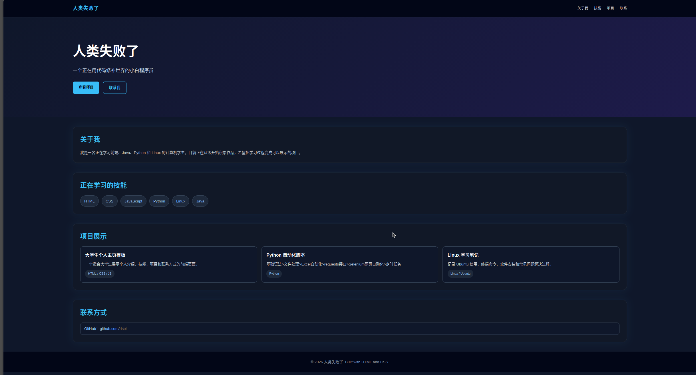

# CS Student Portfolio

一个基于 HTML、CSS 和 JavaScript 制作的计算机学生个人作品集网站，用于展示个人介绍、学习技能、项目作品和联系方式。

## 在线预览

https://rlsbl.github.io/cs-student-portfolio/

## 项目截图

## 功能特点

- 深色科技风格界面
- 顶部导航栏
- 个人介绍区域
- 技能标签展示
- 项目卡片展示
- 联系方式链接
- 返回顶部按钮
- 响应式布局，适配手机和电脑

## 使用技术

- HTML
- CSS
- JavaScript
- GitHub Pages

## 我在这个项目中练习了什么

- HTML 页面结构
- CSS 布局和样式
- JavaScript 事件监听
- 响应式设计
- GitHub 仓库管理
- GitHub Pages 部署

## 后续计划

- 添加头像区域
- 增加更多项目卡片
- 优化移动端显示效果
- 制作可复用模板版本
